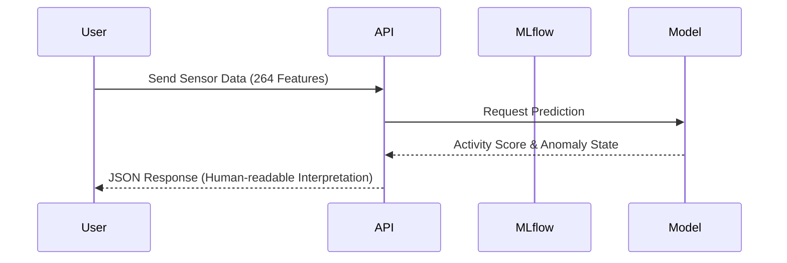

# Presentation Guide

This guide helps you structure a demonstration of the StudentLife-Phenotyping project for conferences, technical reviews, or stakeholder meetings.

## 📊 System Flow

## 📈 Key Visuals & Findings (Slide Deck Assets)

Include these pre-generated charts from the `reports/figures/` directory to build a compelling narrative:

### 1. Stress Prediction (SOTA Model Performance)
**File**: `reports/figures/modeling/sota_comparison.png`
* **Talking Point**: Explain how our soft-voting ensemble mechanism dramatically outperforms baseline guessing (2.1x better), overcoming temporal distribution shifts in finals week vs mid-term.

### 2. Feature Importance (SHAP)
**File**: `reports/figures/modeling/sota_shap_importance.png`
* **Talking Point**: Which behaviors actually predict stress? Highlight that physical activity, sleep cycles, and audio context play massive roles—validating the hypothesis that passive sensors capture mental health proxies.

### 3. Sensor vs Stress Correlation
**File**: `reports/figures/correlation/01_sensor_stress_correlation.png`
* **Talking Point**: Display linear relationships between raw behavioral inputs (like unlock frequency) and self-reported stress EMA.

### 4. Stress Fluctuations Over Time
**File**: `reports/figures/ema/02_stress_over_time.png`
* **Talking Point**: Highlight natural student stress peaks aligning with the academic calendar (e.g., midterms, project deadlines, finals).

## 🚀 Live Demo Script

1. **Deploy**: Show the 1-command startup: `bash setup_and_run.sh`. 
2. **Access MLflow**: Open `http://localhost:5000` to demo experiment tracking.
3. **Execute API Call**: 
   - Open Swagger docs `http://localhost:8000/docs`.
   - Explain the output formatting: Instead of raw numbers, the API yields `anomaly_score=71` and `status_indicator="yellow"`.
4. **Discuss Impact**: Zero-burden mental health tracking! The system requires absolutely *no manual input* from the patient after calibration.
